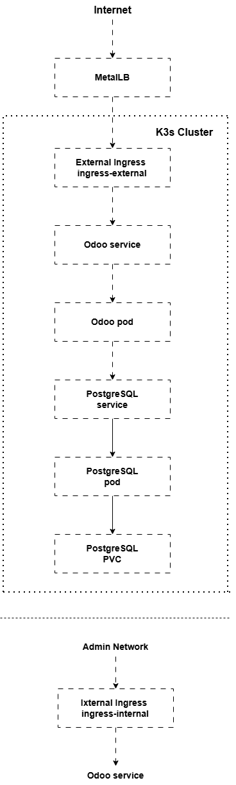
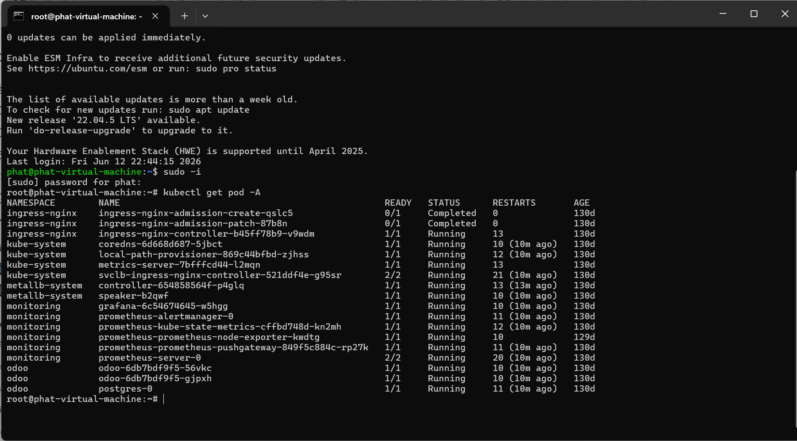
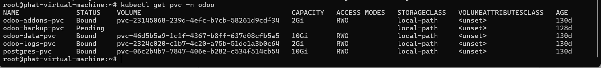
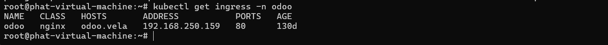
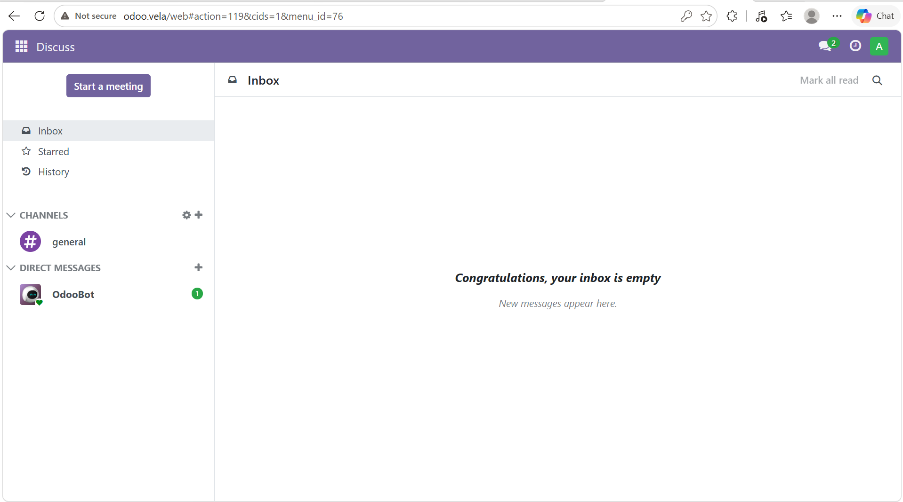
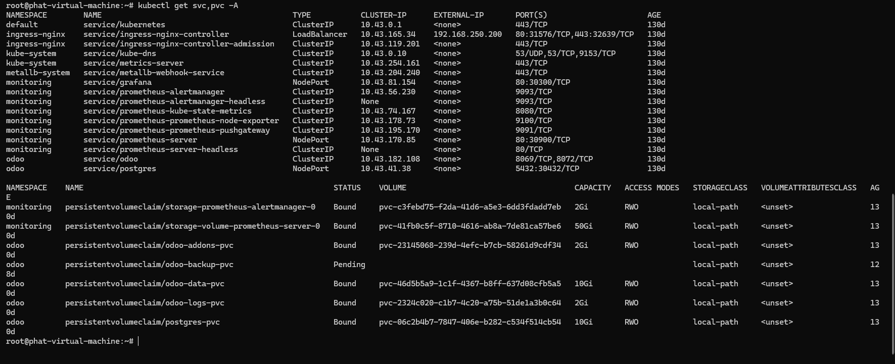
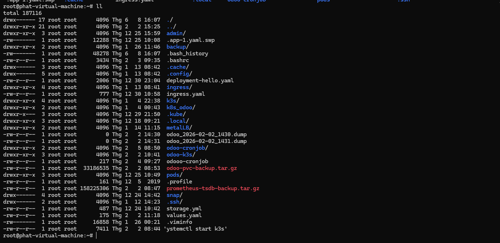

# Odoo ERP Deployment on Kubernetes (K3s)

## Project Overview

This project demonstrates the deployment and operation of an Odoo ERP system on a Kubernetes (K3s) cluster running in a virtualized environment.
The goal of the project was not only to deploy Odoo successfully, but also to gain hands-on experience with Kubernetes administration, ingress traffic management, persistent storage, PostgreSQL operations, backup and recovery procedures, and troubleshooting production-like incidents.
Through this project, I explored how a real-world business application can be deployed, exposed, managed, and recovered in a Kubernetes environment.
---
# Objectives

The project was designed to achieve the following goals:

* Deploy Odoo ERP on Kubernetes
* Deploy PostgreSQL as the backend database
* Persist application and database data using Kubernetes Persistent Volumes
* Expose services using NGINX Ingress Controller
* Separate internal and external traffic flows
* Implement traffic control policies
* Configure database backup and recovery procedures
* Simulate infrastructure failures and validate recovery processes

---

# Architecture

## Architecture Diagram



## Infrastructure

Environment:

* Ubuntu Virtual Machine
* K3s Kubernetes Cluster
* Docker Container Runtime

Core Components:

* Odoo 17
* PostgreSQL
* NGINX Ingress Controller
* MetalLB
* PersistentVolumeClaims (local-path)

---

## Logical Architecture

```
                    Internet
                        |
                  External Ingress
                        |
                   Odoo Service
                        |
                    Odoo Pod
                        |
                PostgreSQL Service
                        |
                 PostgreSQL Pod
                        |
                       PVC
                        |
                 Administrators
                        |
                Internal Ingress
                        |
                   Odoo Service
                        |
                    Odoo Pod

The architecture separates internal administrative access from external user access while sharing the same backend application and database services.

---

# Kubernetes Resources

The following Kubernetes resources were created and managed:

## Application Layer

* Deployment (Odoo)
* Service (Odoo)

## Database Layer

* Deployment (PostgreSQL)
* Service (PostgreSQL)
* PersistentVolumeClaim (Database Storage)

## Networking Layer

* Internal Ingress
* External Ingress
* NGINX Ingress Controller
* MetalLB

## Storage Layer

Persistent storage was configured for:

* PostgreSQL database files
* Odoo filestore
* Odoo logs
* Custom addons

---

# Internal and External Ingress Design

One of the main objectives of the project was to separate traffic based on usage.

## Internal Ingress

Purpose:

* Administrative access
* Operational management
* Internal users

Characteristics:

* Larger upload limits
* Longer timeout values
* Internal access restrictions

## External Ingress

Purpose:

* Public user access

Characteristics:

* Request limitations
* Connection limitations
* Traffic control policies
* Security-focused configuration

This separation allows different traffic policies to be applied without modifying the application itself.

---

# Traffic Control

Traffic management was implemented through NGINX Ingress annotations.

Examples include:

* Connection limits
* Request rate limits
* Request body size restrictions
* Read timeout configuration
* Connection timeout configuration

Example use cases:

* Prevent excessive requests from a single client
* Limit large file uploads
* Protect backend services from abuse
* Optimize application responsiveness

---

# Odoo Custom Module Management

Custom Odoo modules were deployed through mounted addon directories.

Process:

1. Upload module package
2. Extract module into addon directory
3. Refresh application list
4. Install module through Odoo interface

This allowed additional business functionality to be added without rebuilding the application image.

---

# Database Management

PostgreSQL was deployed inside Kubernetes and configured as the backend database for Odoo.

Database persistence was achieved through PersistentVolumeClaims.

Key topics explored:

* Database initialization
* Data persistence
* Storage management
* Database troubleshooting
* Backup and recovery

---

# Backup Strategy

A logical backup strategy was implemented using PostgreSQL pg_dump.

Example:

```bash
kubectl exec deploy/postgres -n odoo -- \
pg_dump -U odoo odoo17_k8s > odoo17_k8s_backup.sql
```

The backup file is stored outside the Kubernetes cluster to prevent data loss in the event of infrastructure failure.

Reasons for choosing pg_dump:

* Simple implementation
* Portable backups
* Easy restoration
* Suitable for small and medium environments

---

# Disaster Recovery

The project included testing recovery scenarios.

## Scenario 1

Node Restart

Expected Result:

* Kubernetes recreates workloads automatically
* PostgreSQL pod starts automatically
* Odoo pod starts automatically
* Existing PVC data remains available

## Scenario 2

Database Failure

Recovery Process:

1. Create a new database
2. Restore from backup file
3. Restart Odoo
4. Validate application functionality

This process ensures business continuity even after database corruption or accidental data loss.

---

# Incident Handling

During deployment, PostgreSQL entered a CrashLoopBackOff state.

Root Cause:

A corrupted PostgreSQL configuration file:

```text
postgresql.auto.conf
```

Symptoms:

* PostgreSQL failed to start
* Odoo became unavailable

Resolution:

* Investigated PostgreSQL logs
* Identified configuration corruption
* Recovered database startup without deleting persistent data
* Validated application recovery

This incident provided practical experience in diagnosing and resolving stateful workload failures.

---

# Lessons Learned

Throughout the project, I gained practical experience in:

## Kubernetes

* Deployments
* Services
* Ingress
* Persistent Volumes
* Desired State Reconciliation
* Self-Healing Mechanisms

## Networking

* Internal vs External Traffic Separation
* Host-Based Routing
* Ingress Traffic Control
* MetalLB Integration

## Storage

* PersistentVolumeClaims
* Local-path Storage
* Data Persistence
* Storage Limitations

## Databases

* PostgreSQL Administration
* Backup Procedures
* Restore Procedures
* Disaster Recovery Planning

---

# Final Outcome

Successfully deployed and operated an Odoo ERP environment on Kubernetes with:

* Persistent application data
* Persistent database storage
* Internal and external ingress architecture
* Traffic control policies
* Backup and recovery procedures
* Incident troubleshooting experience
* Infrastructure failure recovery validation

The project provided hands-on experience with Kubernetes operations and production-oriented application management.

# Screenshots

## Kubernetes Pods



## Persistent Volumes



## Dual Ingress Architecture



## Ingress Classes


## Odoo Application



## Services and PVC



## Database Backup

